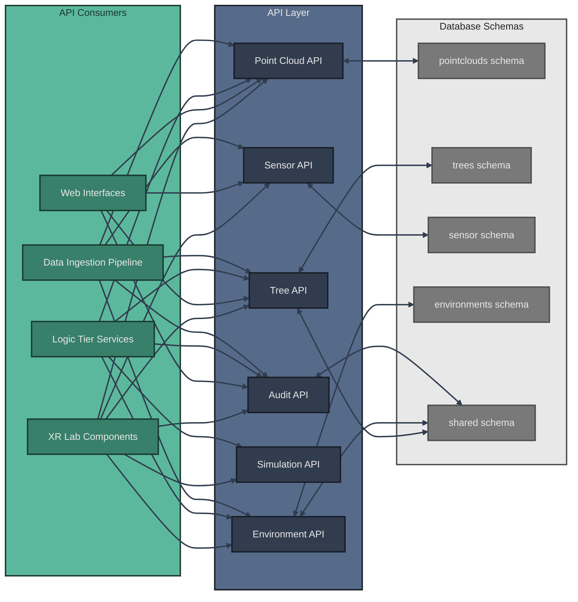

# API Architecture

The XR Future Forests Lab implements a comprehensive API layer powered by **PostgREST**, which automatically generates RESTful APIs directly from the PostgreSQL database schema. This approach eliminates the need for custom API code while providing a standardized, type-safe interface for all system components. PostgREST translates HTTP requests into optimized SQL queries, ensuring efficient data access with built-in support for filtering, sorting, pagination, and relationship embedding.

## API Overview



## PostgREST API Fundamentals

### Auto-Generated Endpoints

PostgREST automatically creates REST endpoints for every table and view exposed in the configured schemas (`public`, `shared`, `pointclouds`, `trees`, `sensor`, `environments`). Each table becomes a resource accessible via standard HTTP methods:

- **GET** `/table_name` - List records with filtering, sorting, and pagination
- **GET** `/table_name?id=eq.123` - Retrieve specific records by filter
- **POST** `/table_name` - Create new records (returns created data)
- **PATCH** `/table_name?id=eq.123` - Update records matching filter
- **DELETE** `/table_name?id=eq.123` - Delete records matching filter

### Query Syntax

PostgREST uses URL parameters for powerful query composition:

**Filtering**:
```
GET /Trees?SpeciesID=eq.5                    # Exact match
GET /Trees?Height_m=gt.30                    # Greater than
GET /Trees?Height_m=gte.30&Height_m=lte.50  # Range query
GET /Trees?SpeciesName=like.*Oak*           # Pattern matching
GET /Trees?Position=not.is.null             # Null checks
```

**Sorting**:
```
GET /Trees?order=Height_m.desc              # Descending order
GET /Trees?order=Height_m.asc,Age_yrs.desc  # Multi-column sort
```

**Pagination**:
```
GET /Trees?limit=100&offset=0               # Standard pagination
GET /Trees?limit=100                         # First 100 records
```

**Column Selection**:
```
GET /Trees?select=VariantID,Height_m,SpeciesID  # Specific columns
GET /Trees?select=*                              # All columns (default)
```

**Relationship Embedding**:
```
GET /Trees?select=*,Species(*)                          # Embed species data
GET /Trees?select=VariantID,Height_m,Stems(*)          # Embed stems
GET /Trees?select=*,Species(*),PointCloudVariant(*)    # Multiple relations
```

### Authentication & Security

All requests are secured through **Row-Level Security (RLS)** policies defined at the database level. Authentication uses JWT tokens:

```bash
# Authenticated requests
curl -H "Authorization: Bearer ${SUPABASE_ANON_KEY}" \
     https://api.xrforests.com/rest/v1/Trees

# Service role requests (bypass RLS)
curl -H "Authorization: Bearer ${SUPABASE_SERVICE_ROLE_KEY}" \
     -H "apikey: ${SUPABASE_SERVICE_ROLE_KEY}" \
     https://api.xrforests.com/rest/v1/Trees
```

## Core APIs

### Audit API

The Audit API provides field-level change tracking and history management across all variant tables through the `shared.AuditLog` table and its junction tables.

**List all audit records**:
```
GET /AuditLog?order=Timestamp.desc&limit=100
```

**Get audit history for specific tree**:
```
GET /AuditLog_Trees?TreeVariantID=eq.123&select=*,AuditLog(*)
```

**Filter by user and date range**:
```
GET /AuditLog?UserID=eq.user123&Timestamp=gte.2024-01-01&Timestamp=lte.2024-12-31
```

**Track field-specific changes**:
```
GET /AuditLog?FieldName=eq.Height_m&order=Timestamp.desc
```

### Point Cloud API

The Point Cloud API manages all LiDAR data operations stored in the `pointclouds` schema, with S3 URIs for actual file storage.

**Create point cloud record after S3 upload**:
```
POST /PointClouds
Content-Type: application/json
{
  "FilePath": "s3://xr-forests-lidar/site1/2024/scan_001.laz",
  "LocationID": 5,
  "CaptureDate": "2024-03-15",
  "ProcessingStatus": "pending",
  "ScanType": "terrestrial"
}
```

**Query by location and status**:
```
GET /PointClouds?LocationID=eq.5&ProcessingStatus=eq.completed
```

**Query by date range**:
```
GET /PointClouds?CaptureDate=gte.2024-01-01&CaptureDate=lte.2024-12-31
```

**Get processing variants with parent lineage**:
```
GET /PointClouds?ParentVariantID=eq.100&select=*
```

**Retrieve with embedded trees and metadata**:
```
GET /PointClouds?select=*,Trees(*),Location(LocationName)
```

**Update processing status**:
```
PATCH /PointClouds?VariantID=eq.123
Content-Type: application/json
{
  "ProcessingStatus": "completed",
  "TotalPoints": 45000000,
  "GroundPointsPercent": 15.3
}
```

**Get S3 presigned URL** (via Edge Function):
```
POST /functions/v1/s3-presigned-url
Content-Type: application/json
{
  "file_path": "s3://xr-forests-lidar/site1/2024/scan_001.laz",
  "expiration_seconds": 3600
}
```

### Tree API

The Tree API serves as the primary interface for forest inventory data stored in the `trees` schema, with support for multi-stem trees and full variant lineage.

**Create new tree record**:
```
POST /Trees
Content-Type: application/json
{
  "SpeciesID": 5,
  "LocationID": 10,
  "Height_m": 25.5,
  "Age_yrs": 45,
  "Position": "POINT(11.5755 48.1372)",
  "CrownDiameter_m": 8.2,
  "HealthStatus": "healthy"
}
```

**Create multi-stem tree with stems**:
```
POST /Trees
Content-Type: application/json
{
  "SpeciesID": 5,
  "Height_m": 25.5,
  "Position": "POINT(11.5755 48.1372)"
}

# Then add stems
POST /Stems
Content-Type: application/json
[
  {"TreeVariantID": 123, "StemNumber": 1, "DBH_cm": 45.2, "Height_m": 25.5},
  {"TreeVariantID": 123, "StemNumber": 2, "DBH_cm": 38.1, "Height_m": 23.8}
]
```

**Query by species and location**:
```
GET /Trees?SpeciesID=eq.5&LocationID=eq.10&select=*,Species(CommonName,ScientificName)
```

**Spatial filtering** (requires PostGIS):
```
GET /Trees?Position=not.is.null&order=Height_m.desc&limit=100
```

**QR code lookup**:
```
GET /Trees?QRCode=eq.TREE-2024-001&select=*,Species(*),Stems(*)
```

**Get tree with full lineage and history**:
```
GET /Trees?VariantID=eq.123&select=*,ParentVariantID,CreatedBy,CreatedAt
GET /AuditLog_Trees?TreeVariantID=eq.123&select=*,AuditLog(*)&order=AuditLog(Timestamp).desc
```

**Update field measurements** (triggers audit logging):
```
PATCH /Trees?VariantID=eq.123
Content-Type: application/json
{
  "Height_m": 26.8,
  "DBH_cm": 48.5,
  "HealthStatus": "healthy"
}
```

**Complex query with multiple embeddings**:
```
GET /Trees?select=*,Species(*),Stems(*),Location(LocationName),PointCloudVariant(FilePath)&Height_m=gt.20&limit=50
```

**Store simulation results as new variant**:
```
POST /Trees
Content-Type: application/json
{
  "ParentVariantID": 123,
  "SpeciesID": 5,
  "Height_m": 28.5,
  "Age_yrs": 50,
  "Position": "POINT(11.5755 48.1372)",
  "ProcessID": 42
}
```

### Sensor API

The Sensor API handles environmental monitoring infrastructure stored in the `sensor` schema, with time-series optimizations for high-frequency readings.

**Register new sensor installation**:
```
POST /Sensors
Content-Type: application/json
{
  "SensorType": "temperature",
  "LocationID": 10,
  "Position": "POINT(11.5755 48.1372)",
  "InstallationDate": "2024-01-15",
  "Manufacturer": "EcoSense",
  "Model": "ES-TEMP-2000",
  "CalibrationDate": "2024-01-10"
}
```

**High-throughput sensor reading ingestion**:
```
POST /SensorReadings
Content-Type: application/json
[
  {
    "SensorID": 5,
    "Timestamp": "2024-03-15T10:00:00Z",
    "Value": 18.5,
    "Unit": "celsius",
    "QualityFlag": "valid"
  },
  {
    "SensorID": 5,
    "Timestamp": "2024-03-15T10:15:00Z",
    "Value": 18.7,
    "Unit": "celsius",
    "QualityFlag": "valid"
  }
]
```

**Query recent readings for sensor**:
```
GET /SensorReadings?SensorID=eq.5&Timestamp=gte.2024-03-15&order=Timestamp.desc&limit=1000
```

**Get sensor status with latest reading**:
```
GET /Sensors?SensorID=eq.5&select=*,SensorReadings(*)&SensorReadings.order=Timestamp.desc&SensorReadings.limit=1
```

**Query readings with aggregation** (requires database view):
```
GET /sensor_readings_hourly?SensorID=eq.5&date=eq.2024-03-15
```

**Spatial sensor queries**:
```
GET /Sensors?LocationID=eq.10&select=*,Location(LocationName)
```

**Monitor sensor health**:
```
GET /Sensors?Status=eq.offline&order=LastMaintenanceDate.asc
```

### Environment API

The Environment API consolidates environmental context data stored in the `environments` schema, supporting both sensor-derived and user-defined scenarios.

**Create environment variant from sensor data**:
```
POST /Environments
Content-Type: application/json
{
  "LocationID": 10,
  "ScenarioID": 1,
  "TemperatureAvg_C": 18.5,
  "HumidityAvg_Percent": 65.2,
  "CO2Concentration_ppm": 420,
  "SoilMoisture_Percent": 45.0,
  "DataSource": "sensor_aggregation"
}
```

**Create user-defined scenario for simulation**:
```
POST /Environments
Content-Type: application/json
{
  "LocationID": 10,
  "ScenarioID": 2,
  "TemperatureAvg_C": 22.0,
  "HumidityAvg_Percent": 70.0,
  "CO2Concentration_ppm": 550,
  "PrecipitationTotal_mm": 1200,
  "DataSource": "user_defined"
}
```

**Query environments by location and scenario**:
```
GET /Environments?LocationID=eq.10&ScenarioID=eq.1&select=*,Location(LocationName),Scenario(ScenarioName)
```

**Get environment with variant lineage**:
```
GET /Environments?VariantID=eq.50&select=*,ParentVariantID,CreatedBy,CreatedAt
```

**Update environmental parameters** (triggers audit):
```
PATCH /Environments?VariantID=eq.50
Content-Type: application/json
{
  "TemperatureAvg_C": 19.2,
  "HumidityAvg_Percent": 67.5
}
```

**Query change history**:
```
GET /AuditLog_Environments?EnvironmentVariantID=eq.50&select=*,AuditLog(*)&order=AuditLog(Timestamp).desc
```

**Retrieve environmental context for growth simulation**:
```
GET /Environments?LocationID=eq.10&ScenarioID=eq.1&select=TemperatureAvg_C,PrecipitationTotal_mm,SoilMoisture_Percent,CO2Concentration_ppm
```

### Simulation API

The Simulation API orchestrates growth modeling workflows through **Edge Functions** that coordinate between the database and external models like SILVA.

**Create simulation parameter set**:
```
POST /SimulationParameters
Content-Type: application/json
{
  "ScenarioID": 2,
  "ModelName": "SILVA",
  "ParameterSet": {
    "growth_rate_modifier": 1.2,
    "competition_factor": 0.8,
    "climate_scenario": "RCP4.5"
  },
  "Description": "Increased CO2 scenario"
}
```

**Trigger growth simulation** (via Edge Function):
```
POST /functions/v1/run-simulation
Content-Type: application/json
{
  "tree_variant_ids": [123, 124, 125],
  "environment_variant_id": 50,
  "parameter_set_id": 10,
  "model_type": "SILVA",
  "simulation_years": 10
}

Response:
{
  "simulation_id": "abc123",
  "status": "running",
  "estimated_completion": "2024-03-15T10:30:00Z"
}
```

**Check simulation progress** (via Edge Function):
```
GET /functions/v1/simulation-status?simulation_id=abc123

Response:
{
  "simulation_id": "abc123",
  "status": "completed",
  "progress_percent": 100,
  "result_variant_ids": [456, 457, 458]
}
```

**Query simulation results** (stored as TreeVariants):
```
GET /Trees?ProcessID=eq.42&select=*,Species(*),ParentVariantID
```

**Retrieve simulation parameters**:
```
GET /SimulationParameters?ScenarioID=eq.2&select=*,Scenario(ScenarioName)
```

**Coordinate data for simulation** (via Edge Function):
```
POST /functions/v1/prepare-simulation-data
Content-Type: application/json
{
  "tree_ids": [123, 124, 125],
  "environment_id": 50
}

Response:
{
  "trees": [...],
  "environment": {...},
  "formatted_for_model": "SILVA"
}
```

## Advanced Features

### Real-time Subscriptions

Supabase Realtime enables WebSocket subscriptions to database changes, allowing XR applications and web interfaces to receive instant updates.

**JavaScript/TypeScript client example**:
```typescript
import { createClient } from '@supabase/supabase-js'

const supabase = createClient(SUPABASE_URL, SUPABASE_ANON_KEY)

// Subscribe to tree updates
const treeSubscription = supabase
  .channel('tree-changes')
  .on('postgres_changes',
    {
      event: '*',
      schema: 'trees',
      table: 'Trees',
      filter: 'LocationID=eq.10'
    },
    (payload) => {
      console.log('Tree updated:', payload)
      updateVirtualForest(payload.new)
    }
  )
  .subscribe()

// Subscribe to sensor readings
const sensorSubscription = supabase
  .channel('sensor-readings')
  .on('postgres_changes',
    {
      event: 'INSERT',
      schema: 'sensor',
      table: 'SensorReadings',
      filter: 'SensorID=eq.5'
    },
    (payload) => {
      console.log('New reading:', payload.new)
      updateEnvironmentVisualization(payload.new)
    }
  )
  .subscribe()
```

### Bulk Operations

PostgREST supports bulk inserts and updates for efficient batch processing.

**Bulk insert trees**:
```
POST /Trees
Content-Type: application/json
Prefer: return=representation

[
  {"SpeciesID": 5, "Height_m": 25.5, "Position": "POINT(11.5755 48.1372)"},
  {"SpeciesID": 5, "Height_m": 22.3, "Position": "POINT(11.5760 48.1375)"},
  {"SpeciesID": 8, "Height_m": 30.1, "Position": "POINT(11.5765 48.1378)"}
]
```

**Bulk update processing status**:
```
PATCH /PointClouds?ProcessingStatus=eq.pending
Content-Type: application/json

{
  "ProcessingStatus": "queued"
}
```

### Stored Procedures & RPC

Custom PostgreSQL functions can be called via RPC endpoints.

**Call custom function**:
```
POST /rpc/calculate_forest_metrics
Content-Type: application/json

{
  "location_id": 10,
  "start_date": "2024-01-01",
  "end_date": "2024-12-31"
}

Response:
{
  "total_trees": 1523,
  "avg_height_m": 24.5,
  "total_biomass_kg": 125000,
  "species_diversity": 0.82
}
```

**Spatial query function**:
```
POST /rpc/trees_within_radius
Content-Type: application/json

{
  "center_point": "POINT(11.5755 48.1372)",
  "radius_meters": 100
}

Response: [
  {"VariantID": 123, "Height_m": 25.5, "Distance_m": 15.2},
  {"VariantID": 124, "Height_m": 22.3, "Distance_m": 45.7}
]
```

### Aggregations & Statistics

PostgREST supports aggregation queries for statistical analysis.

**Count trees by species**:
```
GET /Trees?select=SpeciesID,count&group=SpeciesID
```

**Average measurements by location**:
```
GET /Trees?select=LocationID,Height_m.avg(),DBH_cm.avg()&group=LocationID
```

### Full-Text Search

PostgreSQL full-text search capabilities are exposed through PostgREST.

**Search tree notes**:
```
GET /Trees?Notes=fts.disease
```

**Search species descriptions**:
```
GET /Species?Description=fts.evergreen
```

## API Gateway Configuration

All API requests are routed through **Kong API Gateway**, which provides:

- **Rate Limiting**: Prevents API abuse
- **CORS**: Configured for web client access
- **Authentication**: JWT validation before reaching PostgREST
- **Request Transformation**: Header and payload modifications
- **Logging**: Centralized request logging via Vector

### Base URLs

- **Local Development**: `http://localhost:54321`
- **Production**: `https://api.xrforests.com`

### API Paths

- **REST API**: `/rest/v1/{table_name}`
- **Auth**: `/auth/v1/{endpoint}`
- **Storage**: `/storage/v1/{bucket}/{path}`
- **Realtime**: `/realtime/v1/websocket`
- **Edge Functions**: `/functions/v1/{function_name}`

## Error Handling

PostgREST returns standard HTTP status codes with detailed error messages:

**404 Not Found**:
```json
{
  "code": "PGRST116",
  "details": null,
  "hint": null,
  "message": "The result contains 0 rows"
}
```

**400 Bad Request**:
```json
{
  "code": "22P02",
  "details": null,
  "hint": null,
  "message": "invalid input syntax for type integer: \"abc\""
}
```

**401 Unauthorized**:
```json
{
  "code": "PGRST301",
  "details": null,
  "hint": null,
  "message": "JWT expired"
}
```

**403 Forbidden** (RLS policy violation):
```json
{
  "code": "42501",
  "details": null,
  "hint": null,
  "message": "new row violates row-level security policy"
}
```

## Performance Optimization

### Indexing

All foreign keys and frequently queried columns are indexed. PostGIS spatial indexes optimize geospatial queries.

### Query Optimization

- Use `select` parameter to request only needed columns
- Apply filters at the database level rather than client-side
- Use pagination (`limit` and `offset`) for large result sets
- Leverage embedded relationships instead of multiple requests

### Caching

Kong API Gateway can be configured with response caching for frequently accessed, rarely changing data:

```
GET /Species  # Cached for 1 hour
GET /Locations  # Cached for 1 hour
```

## API Versioning

PostgREST API versioning is managed through:

1. **Database Migrations**: Schema changes tracked via numbered migration files
2. **API Path Versioning**: `/rest/v1/` prefix allows future API versions
3. **Breaking Changes**: New schemas or views maintain backward compatibility

## Documentation & Testing

- **OpenAPI Schema**: Auto-generated from database schema
- **Interactive Documentation**: Available at `/rest/` (root path)
- **Schema Introspection**: `GET /` returns available tables and relationships
