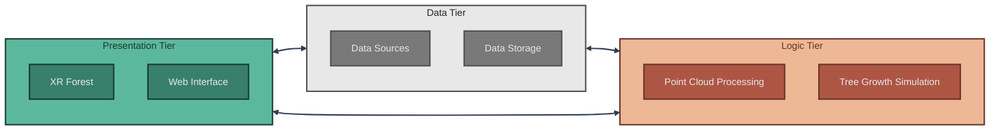
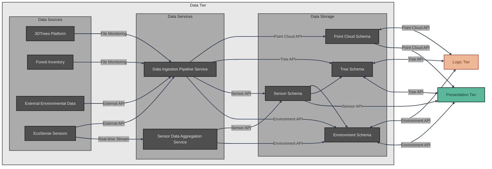
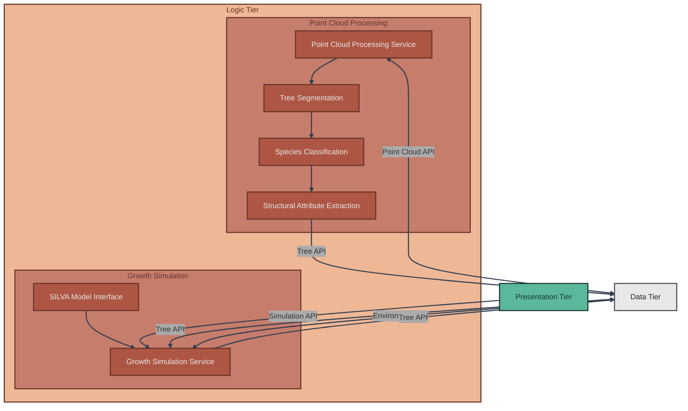
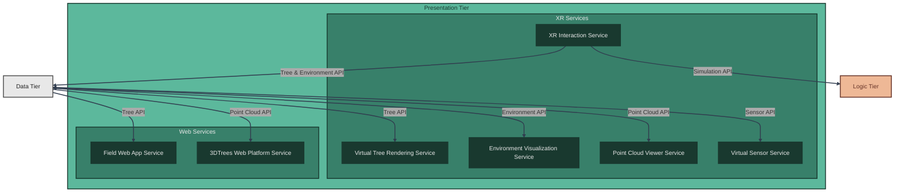

# Architecture

## System Overview

The XR Future Forests Lab follows a modern three-tier architecture designed to seamlessly integrate forest data acquisition, processing, and immersive visualization. This architecture enables the creation of comprehensive digital forest twins that can be experienced through cutting-edge XR technologies.

The **Data Tier** serves as the foundation, managing both data acquisition from diverse sources and robust storage infrastructure built on **Supabase**. It handles data ingestion from external services like EcoSense environmental sensors, forest inventory systems, and the 3DTrees platform, while maintaining a sophisticated PostgreSQL database with PostGIS extensions for spatial data management. **Supabase** provides auto-generated REST APIs via PostgREST, built-in authentication with row-level security, real-time subscriptions via WebSockets, and Edge Functions for serverless business logic. Point cloud files are stored in external S3 buckets with metadata in the database. This tier acts as both a data sink and source, providing bi-directional data flow to support real-time updates and historical analysis. With comprehensive field-level audit logging, the Data Tier ensures complete traceability of all data modifications while maintaining efficient access patterns for both scientific analysis and immersive visualization.

The **Logic Tier** forms the analytical backbone of the system, processing raw forest data into actionable insights. It encompasses advanced point cloud processing for tree segmentation and species classification, as well as sophisticated growth simulation models that predict forest development under various scenarios. This tier transforms disparate data sources into coherent forest models, enabling both scientific analysis and immersive visualization.

The **Presentation Tier** brings the digital forest to life through immersive XR experiences and accessible web interfaces. Users can explore virtual forests, visualize invisible ecological processes like sap flow and nutrient cycling, and interact with growth simulation parameters to understand forest dynamics. With field-level change tracking, users can make precise modifications to forest parameters while maintaining complete audit trails for scientific reproducibility. The tier supports multiple interaction modalities, from fully immersive XR environments to field-accessible web applications for real-time forest monitoring, with comprehensive undo/redo capabilities powered by the underlying audit system.

The architecture's strength lies in its interconnected design: the Data Tier provides comprehensive information to both Logic and Presentation tiers, while the Logic Tier accepts user input from the Presentation Tier to drive interactive simulations. This creates a dynamic ecosystem where data flows seamlessly between acquisition, processing, and visualization, enabling unprecedented insights into forest ecosystems.

---

## Data Tier Architecture

The Data Tier Architecture forms the foundational layer of the XR Future Forests Lab, orchestrating the complex flow of forest data from diverse sources into a unified, spatially-aware database system. This tier is strategically divided into three key components: data sources, ingestion infrastructure, and storage systems.

*Data Sources* represent the diverse ecosystem of forest information providers. The 3DTrees Platform delivers high-resolution LiDAR point clouds as file uploads, while Forest Inventory systems provide structured tree measurement data. EcoSense Sensors continuously stream real-time environmental measurements through dedicated APIs, and External Environmental Data sources contribute broader contextual information such as weather patterns and climate data. This heterogeneous data landscape requires sophisticated coordination to maintain data integrity and temporal consistency.

**Data Ingestion** is managed by **Supabase Edge Functions** that act as intelligent orchestrators for all incoming data streams. These serverless Deno functions continuously monitor file-based sources like 3DTrees and Forest Inventory for new uploads, while maintaining active connections to API-based sources like EcoSense Sensors and external environmental services. The ingestion pipeline handles data validation, format standardization, and temporal alignment before routing information to appropriate database schemas via PostgREST, ensuring consistent data quality across all sources. Additionally, **Edge Functions** process high-frequency sensor readings in real-time, performing quality assessment and temporal aggregation to create meaningful environmental context stored in the Environment Schema.

**Data Storage** implements the comprehensive database design detailed in the database schema documentation, organized into five specialized PostgreSQL schemas (`shared`, `pointclouds`, `trees`, `sensor`, `environments`) with field-level audit logging capabilities. **PostgREST** automatically generates REST API endpoints from these schemas, eliminating the need for custom backend code. **Row-level security (RLS) policies** enforce fine-grained access control at the database level. The Point Cloud Schema manages LiDAR scan metadata with S3 URIs pointing to point cloud files stored in external buckets, maintaining spatial bounds through the `PointClouds` table with variant-based processing lineage. The Tree Schema serves as the central repository for individual tree information with multi-stem support, supporting both measured and simulated data with full temporal tracking, QR code integration for field applications, and granular field-level change auditing for precise measurement updates. The Sensor Schema manages physical sensor installations through the `Sensors` table and time-series environmental measurements via `SensorReadings`, optimized for high-frequency data ingestion and aggregation. The Environment Schema consolidates environmental conditions that can be derived from sensor data, user input, or hybrid approaches, providing essential context for growth modeling and XR visualization with complete change tracking for parameter modifications.

The **Audit Logging System** provides comprehensive field-level change tracking across all variant tables, ensuring complete traceability of data modifications without the overhead of full variant creation. This system captures user attribution, change reasons, and temporal context for every field modification, enabling precise revert capabilities and supporting collaborative research workflows with full accountability.

This architecture enables seamless bi-directional data flow to both Logic and Presentation tiers, supporting real-time updates for immersive experiences while maintaining the historical depth necessary for scientific analysis and growth modeling.

---

## Logic Tier Architecture

The Logic Tier Architecture serves as the analytical engine of the XR Future Forests Lab, transforming raw forest data into actionable insights through sophisticated processing pipelines and predictive modeling. This tier bridges the gap between data acquisition and visualization, enabling both automated analysis and user-driven forest simulations.

**Point Cloud Processing** is implemented by the **Point Cloud Processing Service** which orchestrates the core computational workflow that converts raw LiDAR data into structured forest information through a variant-based processing system. Upon upload through the 3DTrees platform, the system creates a base `PointCloud` record and the service automatically initiates processing variants: Tree Segmentation creates a "Processing_Result" variant with individual tree identification, Species Classification generates additional variants with species-specific attributes, and Structural Attribute Extraction produces final variants containing precise measurements including height, diameter at breast height (DBH), crown dimensions, and crown base height. Each processing step is tracked through the `PointCloudVariants` table with status monitoring (pending, processing, completed, failed) and confidence scores for segmentation and classification. This variant-based approach ensures processing lineage is maintained while derived tree attributes flow into the Tree Schema through `TreeVariants` that reference their originating `PointCloudVariant` via the `PointCloudVariantID` field.

**Growth Simulation** is managed by the **Growth Simulation Service** which leverages external forest growth models to predict tree and forest development under various scenarios. The service integrates with established models like SILVA (individual tree growth) and other tree-based growth models to provide scientifically validated projections. Environmental conditions from the Environment Schema and current tree states from the Tree Schema serve as input parameters, while the Growth Simulation Service prepares data formats specific to each model's requirements. A key innovation is the integration of user interaction from the XR Presentation Tier, allowing researchers and forest managers to modify environmental parameters, adjust management practices, or test climate scenarios in real-time. Simulation results are automatically saved back to the Tree Schema as temporal variants, with the `ModelType` field recording which growth model was used and `TimeDelta_yrs` tracking the projected time progression. This enables users to visualize forest evolution and compare different management strategies within the immersive XR environment through the standardized Simulation API.

This dual-component architecture ensures both automated efficiency and interactive flexibility, supporting the lab's mission to combine rigorous scientific analysis with innovative visualization technologies.

---

## Presentation Tier Architecture

The Presentation Tier Architecture represents the culmination of the XR Future Forests Lab vision, transforming complex forest data into immersive experiences and accessible interfaces that serve diverse user communities from researchers to field practitioners. This tier strategically balances cutting-edge XR technologies with practical web-based tools to maximize accessibility and impact.

**XR Services** form the heart of the forest visualization ecosystem, creating unprecedented immersive experiences that make invisible forest processes tangible and interactive. The **Virtual Tree Rendering Service** renders individual trees with scientific accuracy, incorporating real measurements from the Tree Schema to create photorealistic 3D representations that users can examine at any scale. The **Environment Visualization Service** brings abstract environmental data to life, visualizing wind patterns, water flow, CO₂ circulation, and nutrient cycling as dynamic, interactive phenomena within the virtual forest space. The **Virtual Sensor Service** allows users to deploy and interact with digital representations of EcoSense sensors, enabling hands-on learning about environmental monitoring techniques and data collection methodologies. The **Point Cloud Viewer Service** provides direct access to raw LiDAR data within the XR environment, allowing users to toggle between processed tree models and original scan data for educational and validation purposes.

The **XR Interaction Service** serves as the bridge between user intent and system response, enabling real-time modification of forest parameters and growth scenarios. Users can manipulate environmental variables, remove or replace trees, adjust management practices, and observe immediate visual feedback of their decisions. These interactions seamlessly integrate with the Growth Simulation Service in the Logic Tier through the standardized APIs, creating a dynamic feedback loop where user experiments drive scientific modeling and visualization updates.

**Web Services** ensure broad accessibility and specialized functionality for different user groups. The **Field Web App Service** empowers forest practitioners to access tree information instantly by scanning QR codes attached to individual trees, pulling comprehensive data including growth history, health status, and predicted development trajectories through the Tree API. Each tree's QR code links directly to its `TreeVariants` record, providing immediate access to current measurements, processing confidence scores, and growth model predictions. The **3DTrees Web Platform Service** provides browser-based visualization of uploaded point clouds, with the ability to overlay segmentation results through color-coded point classification and display simplified virtual tree models derived from processing algorithms via the Point Cloud API.

---

## API and Service Integration

The XR Future Forests Lab implements a comprehensive API layer and distributed service architecture that enables seamless data flow between the three architectural tiers. This integration layer ensures all components can communicate effectively while maintaining clear separation of concerns.

### API Layer

The system provides five core APIs that abstract database operations and enable standardized communication:

- **Point Cloud API**: Manages LiDAR data operations and processing workflows
- **Tree API**: Handles forest inventory data with variant tracking and audit capabilities  
- **Sensor API**: Manages environmental monitoring infrastructure and time-series data
- **Environment API**: Consolidates environmental context from multiple sources
- **Simulation API**: Orchestrates growth modeling workflows with external models
- **Audit API**: Provides field-level change tracking across all variant tables

For detailed API specifications, endpoint definitions, and integration patterns, see the [API Architecture Documentation](api.md).

### Service Architecture

The distributed service architecture operates across all three tiers with specialized services consuming the core APIs:

- **Data Tier Services**: Supabase Edge Functions handle ingestion, validation, and aggregation
- **Logic Tier Services**: Implement computational algorithms (Point Cloud Processing, Growth Simulation)
- **Presentation Tier Services**: Provide interfaces and visualization (Web Apps, XR Services)
- **External Integrations**: Interface with third-party systems (SILVA/BALANCE models, EcoSense sensors, 3DTrees platform)

For comprehensive service specifications, functionality details, and deployment considerations, see the [Service Architecture Documentation](services.md).

---

## Supabase Implementation

The Data Tier is built entirely on **Supabase**, an open-source Firebase alternative that provides a complete backend-as-a-service platform. This section details the Supabase services and their role in the architecture.

### Supabase Services Stack

The complete Supabase stack consists of 11 containerized services deployed via Docker Compose:

1. **PostgreSQL + PostGIS** - Core database with spatial extensions
2. **PostgREST** - Auto-generates REST API from database schema
3. **Kong** - API gateway for routing and authentication (replaces nginx)
4. **GoTrue** - Built-in authentication service with JWT support
5. **Realtime** - WebSocket server for live data subscriptions
6. **Storage API** - S3-compatible storage (connects to external S3 for point clouds)
7. **Edge Functions** - Deno-based serverless function runtime
8. **Supabase Studio** - Web-based database management UI
9. **Postgres Meta** - Database metadata and introspection service
10. **ImgProxy** - Image transformation service
11. **Vector** - Log aggregation and observability

### Key Architectural Benefits

**Auto-generated REST API**: PostgREST automatically creates RESTful endpoints for all database tables and views, eliminating the need for custom backend code. Every table in the `shared`, `pointclouds`, `trees`, `sensor`, and `environments` schemas is immediately accessible via HTTP.

**Row-Level Security (RLS)**: Fine-grained access control is enforced at the database level through PostgreSQL RLS policies. These policies define who can read, insert, update, or delete specific rows based on user authentication, eliminating the need for authorization logic in application code.

**Real-time Subscriptions**: The Realtime server provides WebSocket connections for subscribing to database changes. XR applications and web interfaces can receive live updates when trees, sensors, or environmental data changes, enabling collaborative editing and live monitoring.

**Edge Functions for Business Logic**: Complex workflows that cannot be expressed as simple CRUD operations are implemented as Edge Functions (Deno/TypeScript). Examples include:
- Generating S3 presigned URLs for point cloud access
- Orchestrating multi-step processing workflows
- Aggregating sensor data into environmental variants
- Coordinating external model integrations

**S3 Integration**: Point cloud files (up to 2GB) are stored in external S3 buckets. The database stores only S3 URIs (e.g., `s3://bucket-name/file.las`). Edge Functions generate temporary presigned URLs for secure client access without exposing S3 credentials.

**Built-in Authentication**: GoTrue provides JWT-based authentication with support for email/password, OAuth providers, and magic links. User sessions are managed automatically, and authentication tokens are validated by Kong before reaching PostgREST.

### Database Schemas and API Endpoints

All five PostgreSQL schemas are exposed through PostgREST with automatic endpoint generation:

| Schema | Tables | Primary Use | Example Endpoint |
|--------|--------|-------------|------------------|
| `shared` | 15 tables | Reference data, processes, audit logs | `/rest/v1/Species?select=*` |
| `pointclouds` | 1 table | LiDAR metadata with S3 URIs | `/rest/v1/PointClouds?select=*&ProcessingStatus=eq.completed` |
| `trees` | 7 tables | Tree measurements, stems, characteristics | `/rest/v1/Trees?select=*,Species(*),Stems(*)` |
| `sensor` | 3 tables | Sensor installations and time-series readings | `/rest/v1/SensorReadings?Timestamp=gte.2024-01-01` |
| `environments` | 1 table | Environmental condition variants | `/rest/v1/Environments?select=*&ScenarioID=eq.2` |

### Deployment Architecture

**Local Development**:
- Single `docker compose up` command starts all services
- Supabase Studio accessible at `localhost:54323` for database management
- PostgREST API at `localhost:54321/rest/v1`
- Direct PostgreSQL access at `localhost:54322`

**Production Deployment**:
- Same Docker Compose configuration deployed on VM
- Kong handles SSL/TLS termination and HTTPS
- External S3 bucket for point cloud storage
- Automated backups and monitoring
- Horizontal scaling via read replicas

### Migration from FastAPI/nginx

The previous architecture used FastAPI for REST APIs, nginx as a reverse proxy, and Redis for caching/pub-sub. Supabase replaces all three:

| Component | Before | After | Benefit |
|-----------|--------|-------|---------|
| REST API | FastAPI (~2000 lines) | PostgREST (auto-generated) | Zero custom API code |
| API Gateway | nginx | Kong (included) | Unified auth and routing |
| Real-time | Redis pub/sub | Realtime (native) | Built-in WebSockets |
| Authentication | Custom middleware | GoTrue + RLS | Database-level security |
| Caching | Redis | PostgREST + connection pooling | Simplified stack |
| Database UI | External tools | Supabase Studio | Integrated management |

This architecture reduction significantly simplifies deployment, maintenance, and scaling while providing better security and developer experience.

For detailed Supabase setup instructions, see the [Supabase Setup Guide](../supabase/setup-guide.md).
