# Database Design - XR Future Forests Lab

## Digital Twin System Overview

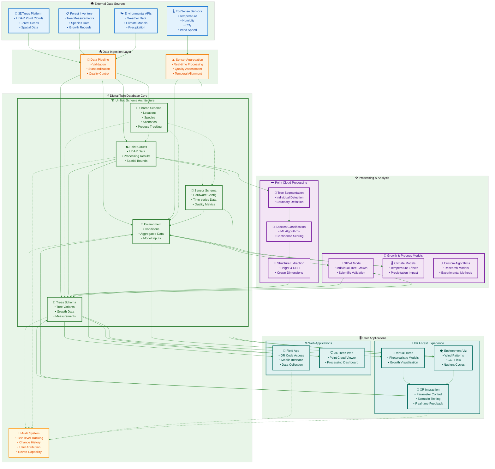

## Supabase Database Implementation

This database is implemented on **Supabase**, a PostgreSQL-based platform that provides:

- **PostgREST Auto-Generated APIs**: Every table automatically gets REST endpoints for CRUD operations, eliminating the need for custom API code
- **Row-Level Security (RLS)**: Fine-grained access control policies defined at the database level for secure multi-user access
- **Real-time Subscriptions**: WebSocket-based change notifications for live updates in XR and web applications
- **Edge Functions**: Deno-based serverless functions for complex business logic (SILVA integration, S3 presigned URLs, data aggregation)
- **Built-in Authentication**: JWT-based auth system (GoTrue) with user management and role-based access
- **PostGIS Extensions**: Full geospatial query capabilities for tree positions, sensor locations, and plot boundaries
- **Automatic Audit Logging**: Database triggers create audit entries automatically on all UPDATE operations
- **S3 Integration**: Point cloud files stored in external S3 buckets, with S3 URIs stored in database

### Key Supabase Features Used

**Auto-Generated REST API via PostgREST**:
- All tables exposed through REST endpoints: `GET/POST/PATCH/DELETE /table_name`
- URL-based filtering, sorting, pagination, aggregation
- Relationship embedding via foreign keys (`?select=*,Species(*),Stems(*)`)
- No custom backend code required for standard CRUD operations

**Row-Level Security Policies**:
```sql
-- Example RLS policy on Trees table
CREATE POLICY "Trees are viewable by everyone"
    ON trees.Trees FOR SELECT
    USING (true);

CREATE POLICY "Authenticated users can update trees"
    ON trees.Trees FOR UPDATE
    TO authenticated
    USING (CreatedBy = auth.uid()::TEXT);
```

**Audit Triggers**:
```sql
-- Automatic field-level change tracking
CREATE TRIGGER audit_trees_changes
    BEFORE UPDATE ON trees.Trees
    FOR EACH ROW
    EXECUTE FUNCTION shared.log_field_changes();
```

**Real-time Change Notifications**:
```javascript
// Client-side real-time subscription
supabase
  .channel('tree-changes')
  .on('postgres_changes', {event: '*', schema: 'trees', table: 'Trees'},
      (payload) => updateVirtualForest(payload.new))
  .subscribe()
```

## Unified Database Design with Schema Organization

This design uses PostgreSQL schemas (`shared`, `pointclouds`, `trees`, `sensor`, `environments`) to organize a unified forest monitoring database deployed on Supabase. The design supports efficient time-series sensor data storage with S3 URIs for point cloud file references.

> **📊 Complete ERD Available**: For a comprehensive view of the entire database structure in a single diagram, see the complete ERD files:
>
> - **Visual ERD**: [`xr_forests_complete_erd.dbml`](./xr_forests_complete_erd.dbml) - Use with [dbdiagram.io](https://dbdiagram.io/) for interactive visualization
> - **SQL Schema**: [`xr_forests_complete_schema.sql`](./xr_forests_complete_schema.sql) - Ready-to-execute PostgreSQL DDL
> - **Usage Guide**: [`README_ERD.md`](./README_ERD.md) - How to use the ERD files

## Schema Overview

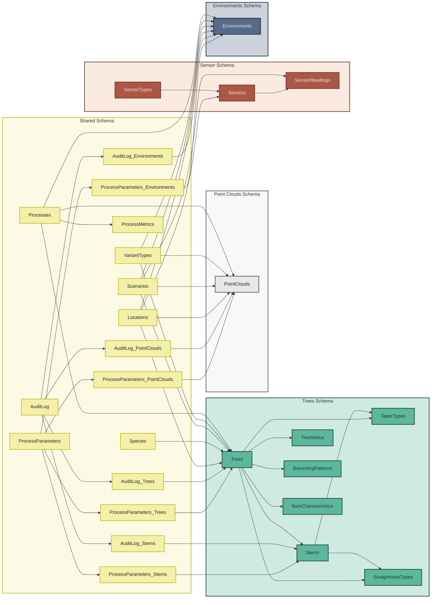

### Shared Schema

Contains reference tables used across all domains, providing consistent data definitions and relationships throughout the forest monitoring system.

#### Location and Environmental Context

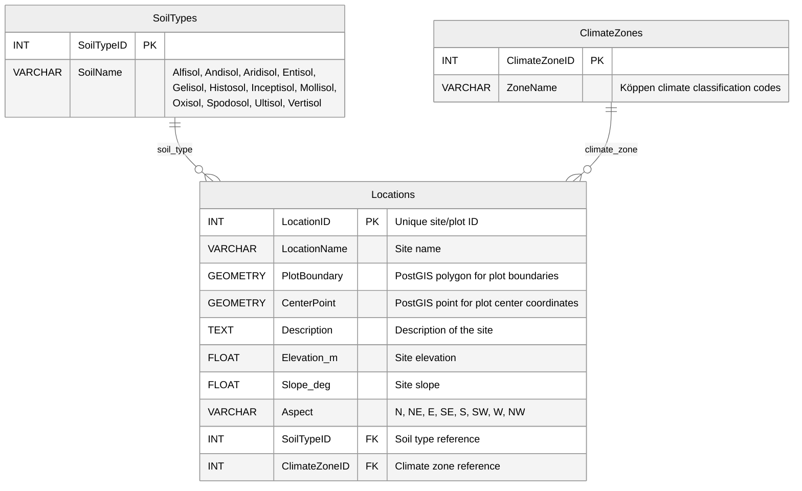

#### Species Reference

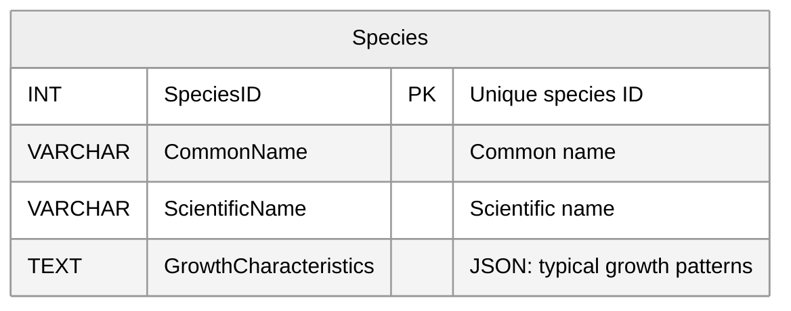

#### Scenarios and Variant Types

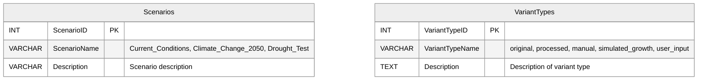

#### Process Management and Algorithm Tracking

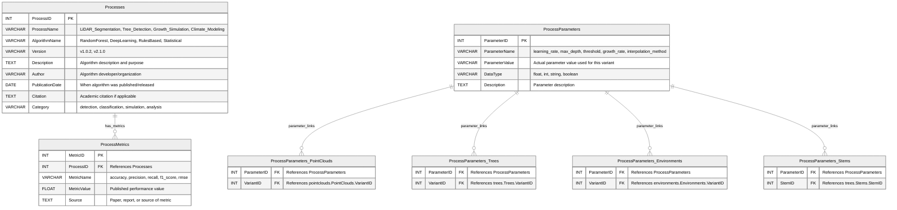

**Junction Table Design**: Process parameters use explicit junction tables to link with domain-specific variants, providing clear foreign key relationships while maintaining flexibility for cross-schema operations.

#### Field-Level Change Tracking

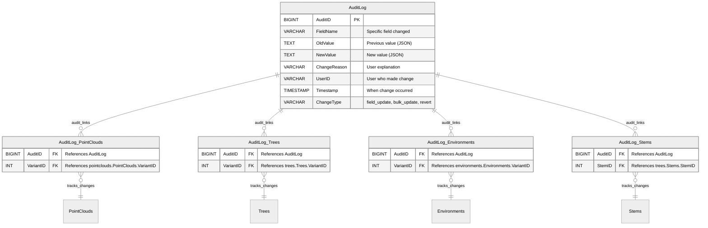

The AuditLog system provides granular change tracking for individual field modifications across all variant tables through explicit junction tables.

**Key Features**:

- **Junction Table Design**: Explicit relationships through dedicated junction tables (AuditLog_PointClouds, AuditLog_Trees, etc.)
- **API-Level Tracking**: All changes go through REST API endpoints to ensure audit logging
- **Granular Logging**: Each field change creates a separate audit entry with full before/after context
- **Revert Capability**: Changes can be undone using audit log data without creating new variants
- **User Attribution**: All changes tracked to specific authenticated users
- **Reason Codes**: Optional explanations provide context for change decisions

**Implementation Strategy**:

1. **Single Field Updates**: Modify variant record directly, create AuditLog entry with junction table link
2. **Multiple Field Updates**: Option to create micro-variant or log individual changes through junction tables
3. **Major Changes**: Continue using full variant system for significant modifications
4. **Revert Operations**: Use audit log to restore previous values with new audit entries

### Point Clouds Schema

Manages LiDAR scan data and processing variants through a unified variant-based approach. Original scans and processed variants are stored in the same table, with variant types determining the relationship and processing status.

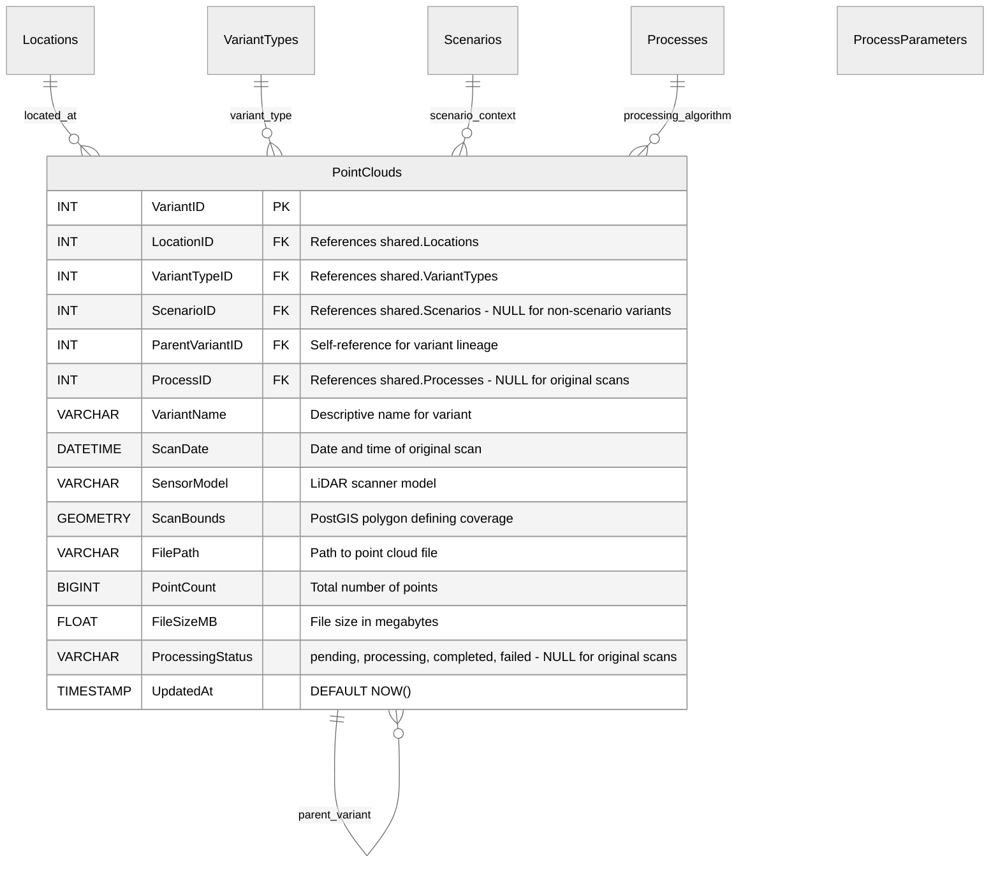

### Trees Schema

Manages tree measurement and simulation data through variants. Each tree variant represents a specific measurement, simulation state, or modeling result that can reference point cloud variants for detection context.

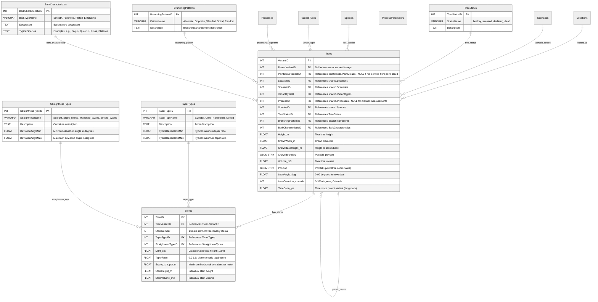

### Sensor Schema

Manages sensor hardware installations and time-series sensor readings. Base tables contain sensor metadata and installation info, while readings tables contain actual sensor measurements optimized for time-series queries.

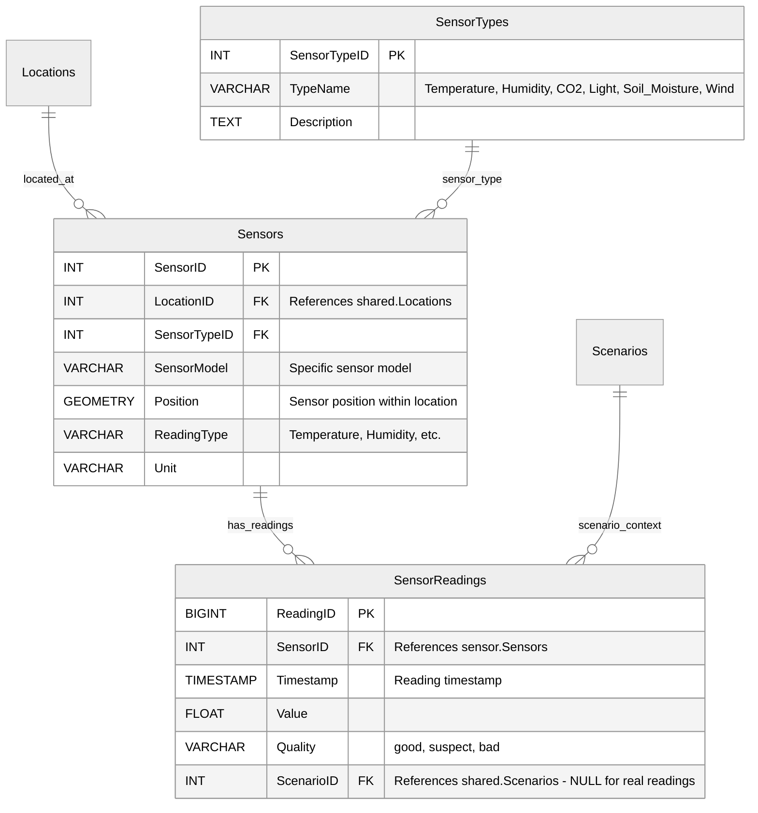

### Environments Schema

Manages environmental variants that can be derived from sensor combinations, user input, or hybrid approaches for modeling and analysis context.

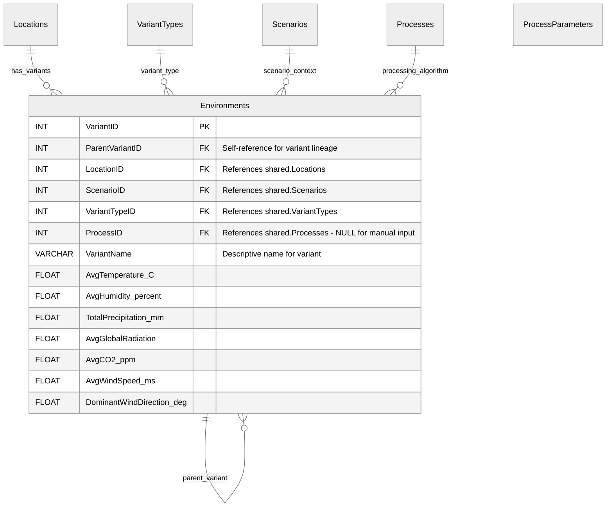
