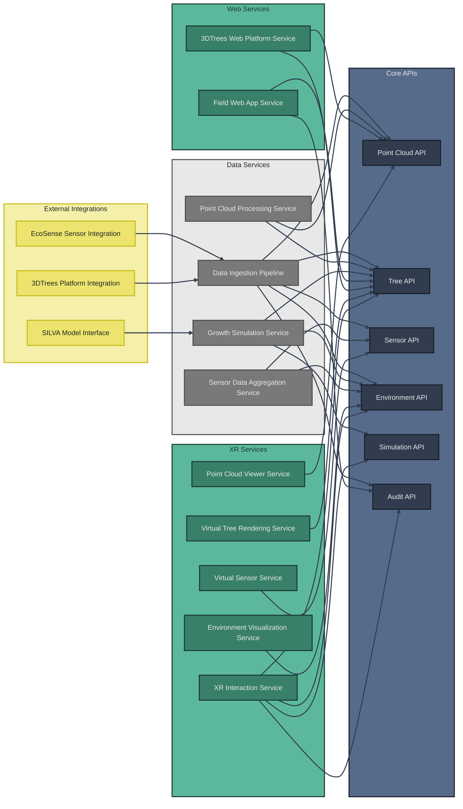

# System Services Architecture

The XR Future Forests Lab is composed of multiple interconnected services built on the **Supabase platform**. The architecture leverages PostgREST auto-generated APIs, Edge Functions (Deno runtime), and real-time subscriptions to deliver comprehensive forest monitoring, analysis, and visualization capabilities. This document describes both the Supabase infrastructure services and the application-layer services that consume the APIs.

## Service Overview



## Supabase Infrastructure Services

### PostgreSQL Database (supabase/postgres)

**Purpose**: Core database service with PostGIS spatial extensions and custom schemas.

**Key Features**:
- **PostGIS**: Geospatial query capabilities for tree positions and sensor locations
- **Multi-Schema**: Organized into `shared`, `pointclouds`, `trees`, `sensor`, `environments` schemas
- **Triggers**: Automatic audit logging on all UPDATE operations
- **Constraints**: S3 URI validation, foreign key integrity, check constraints
- **Indexes**: Spatial indexes (GIST), B-tree indexes on foreign keys and query columns

**Container**: `xr_forests_db`
**Port**: `54322:5432`

### PostgREST API Server (postgrest/postgrest)

**Purpose**: Auto-generates RESTful API from database schema, eliminating custom API code.

**Key Features**:
- **Auto-Generation**: Creates CRUD endpoints for all tables and views
- **Query Language**: URL-based filtering, sorting, pagination, aggregation
- **Relationship Embedding**: Automatic JOIN queries via foreign keys
- **RLS Integration**: Enforces row-level security policies on all requests
- **OpenAPI Schema**: Self-documenting API with introspection

**Container**: `xr_forests_rest`
**Exposed Schemas**: `public`, `shared`, `pointclouds`, `trees`, `sensor`, `environments`

### Kong API Gateway (kong)

**Purpose**: API gateway that routes requests to appropriate Supabase services with authentication and rate limiting.

**Key Features**:
- **Request Routing**: Routes to PostgREST, Auth, Storage, Realtime, Functions
- **JWT Validation**: Validates authentication tokens before forwarding requests
- **CORS**: Configured for web client access from multiple origins
- **Rate Limiting**: Prevents API abuse with configurable limits
- **Request Transformation**: Adds/removes headers, modifies payloads

**Container**: `xr_forests_kong`
**Ports**: `54321:8000` (HTTP), `54322:8443` (HTTPS)

### GoTrue Authentication (supabase/gotrue)

**Purpose**: JWT-based authentication service with user management.

**Key Features**:
- **User Registration**: Email/password signup with email confirmation
- **JWT Tokens**: Issues access and refresh tokens
- **Role Management**: `anon`, `authenticated`, `service_role` roles
- **OAuth Providers**: Extensible for Google, GitHub, etc.
- **Password Recovery**: Email-based password reset flows

**Container**: `xr_forests_auth`

### Realtime Server (supabase/realtime)

**Purpose**: WebSocket server for real-time database change subscriptions.

**Key Features**:
- **PostgreSQL Replication**: Listens to database WAL for changes
- **Channel-Based**: Clients subscribe to specific tables/filters
- **Event Types**: INSERT, UPDATE, DELETE notifications
- **Presence**: User presence tracking for collaborative features
- **Broadcast**: Custom message broadcasting between clients

**Container**: `xr_forests_realtime`

### Storage API (supabase/storage-api)

**Purpose**: S3-compatible storage API with database integration for metadata.

**Key Features**:
- **S3 Backend**: Connects to external S3 buckets for LiDAR files
- **Large Files**: Supports up to 2GB per file for point cloud data
- **Access Control**: RLS policies on storage buckets
- **Presigned URLs**: Temporary download URLs via Edge Function
- **Metadata Storage**: File paths stored in database as S3 URIs

**Container**: `xr_forests_storage`

### Edge Functions (supabase/edge-runtime)

**Purpose**: Deno-based serverless functions for custom business logic.

**Key Functions**:
- **s3-presigned-url**: Generates temporary S3 download URLs
- **run-simulation**: Orchestrates SILVA model execution
- **prepare-simulation-data**: Formats data for external models
- **process-point-cloud**: Triggers LiDAR processing pipelines
- **aggregate-sensor-data**: Creates environment variants from sensor readings

**Container**: `xr_forests_functions`
**Runtime**: Deno v1.30.5

### Studio (supabase/studio)

**Purpose**: Web-based database management UI for development and administration.

**Key Features**:
- **Schema Editor**: Visual database schema management
- **Table Editor**: Browse and edit table data
- **SQL Editor**: Execute custom SQL queries
- **API Docs**: Interactive API documentation
- **Logs**: View database and API logs

**Container**: `xr_forests_studio`
**Port**: `54323:3000`

### Meta Service (supabase/postgres-meta)

**Purpose**: Provides metadata about database schema for Studio and introspection.

**Container**: `xr_forests_meta`

### Vector (timberio/vector)

**Purpose**: Log aggregation and observability pipeline.

**Container**: `xr_forests_vector`

### ImgProxy (darthsim/imgproxy)

**Purpose**: Image transformation service for photo attachments.

**Container**: `xr_forests_imgproxy`

## Application Services

### Data Ingestion Pipeline Service

**Purpose**: Orchestrates the collection, validation, and initial processing of data from diverse forest monitoring sources with comprehensive audit logging.

**Implementation**: Edge Functions + scheduled jobs

**Key Functionality**:

- **File Monitoring**: Watches 3DTrees Platform and Forest Inventory systems for new uploads
- **S3 Integration**: Handles point cloud file uploads to S3, stores URIs in database
- **API Integration**: Maintains connections to EcoSense sensors and external data sources
- **Data Validation**: Ensures incoming data meets quality standards and format requirements
- **Format Standardization**: Converts diverse data formats into consistent internal representations
- **Temporal Alignment**: Synchronizes timestamps across different data sources
- **Schema Routing**: Directs validated data to appropriate database tables via PostgREST
- **Change Audit**: Automatic audit logging via database triggers

**API Dependencies**: PostgREST APIs for all schemas, Storage API, Edge Functions

### Point Cloud Processing Service

**Purpose**: Transforms raw LiDAR data into structured forest information through automated analysis pipelines.

**Implementation**: External Python/C++ processing services + Edge Functions for orchestration

**Key Functionality**:

- **S3 File Access**: Downloads point cloud files from S3 using presigned URLs
- **Tree Segmentation**: Identifies individual trees within point cloud data using advanced algorithms
- **Species Classification**: Applies machine learning models to classify tree species based on geometric characteristics
- **Structural Analysis**: Extracts precise measurements (height, DBH, crown dimensions) from segmented trees
- **Processing Status Management**: Updates PointCloud records via PostgREST API
- **Confidence Scoring**: Stores reliability metrics in database
- **Variant Creation**: Creates child PointCloudVariants for different processing stages
- **Tree Record Creation**: Inserts detected trees via PostgREST bulk insert

**API Dependencies**: PostgREST PointCloud API, Tree API, s3-presigned-url Edge Function

### Growth Simulation Service

**Purpose**: Orchestrates forest growth modeling using external scientific models and user-defined scenarios.

**Implementation**: Edge Functions (run-simulation, prepare-simulation-data) + external SILVA model service

**Key Functionality**:

- **Model Integration**: Interfaces with external growth models (SILVA) via HTTP APIs
- **Scenario Management**: Queries Environments and SimulationParameters via PostgREST
- **Parameter Preparation**: Fetches current tree and environmental data via PostgREST
- **Data Formatting**: Converts database records to SILVA input format
- **Simulation Orchestration**: Executes growth models with appropriate input parameters
- **Result Processing**: Converts model outputs into new TreeVariants with ParentVariantID linkage
- **Bulk Insertion**: Creates future tree states via PostgREST bulk insert
- **Interactive Simulation**: Supports real-time parameter modification from XR interfaces with automatic audit logging

**API Dependencies**: PostgREST Tree API, Environment API, SimulationParameters table, Edge Functions

### Sensor Data Aggregation Service

**Purpose**: Processes high-frequency sensor data into meaningful environmental context for forest analysis.

**Implementation**: Edge Function (aggregate-sensor-data) + scheduled cron jobs

**Key Functionality**:

- **Real-time Processing**: Triggered by Realtime subscriptions to SensorReadings table
- **Data Quality Assessment**: Flags suspect readings by updating QualityFlag column via PostgREST
- **Temporal Aggregation**: Queries SensorReadings with time-range filters, computes aggregates
- **Spatial Correlation**: Uses PostGIS queries to associate readings with forest locations
- **Environment Variant Creation**: Inserts new EnvironmentVariants via PostgREST with aggregated data
- **Alert Generation**: Monitors sensor health via database queries, sends notifications
- **Time-Series Optimization**: Leverages PostgreSQL time-series features for efficient queries

**API Dependencies**: PostgREST Sensor API, Environment API, Realtime subscriptions, Edge Functions

## Web Services

### Field Web App Service

**Purpose**: Provides mobile-optimized forest inventory access for field researchers and forest managers with comprehensive change tracking.

**Implementation**: Progressive Web App (PWA) using Supabase JavaScript client

**Key Functionality**:

- **QR Code Scanning**: Instant tree lookup via PostgREST query (`GET /Trees?QRCode=eq.{code}`)
- **Tree Information Display**: Fetches tree data with embedded species, stems, history via relationship embedding
- **Field-Level Editing**: Updates tree measurements via PATCH requests, triggers automatic audit logging
- **Change History Viewing**: Queries AuditLog_Trees with embedded AuditLog records
- **Offline Capability**: Supabase client SDK caching + service worker for offline functionality
- **Data Collection Interface**: Forms submit directly to PostgREST API
- **Photo Integration**: Uploads to Supabase Storage, stores URLs in database
- **GPS Integration**: Captures location via browser Geolocation API, stores as PostGIS POINT
- **Real-time Sync**: Realtime subscriptions for collaborative editing
- **Authentication**: GoTrue login with field worker credentials

**API Dependencies**: PostgREST Tree API, Audit API, Supabase JS client, Storage API, GoTrue Auth

### 3DTrees Web Platform Service

**Purpose**: Delivers browser-based visualization and management of point cloud data and processing results.

**Implementation**: React/Three.js web application using Supabase JavaScript client

**Key Functionality**:

- **Point Cloud Visualization**: Fetches S3 presigned URLs via Edge Function, renders with Potree/Three.js
- **Processing Result Overlay**: Queries PointClouds and Trees tables, overlays segmentation on 3D view
- **Upload Management**: Direct S3 uploads, creates PointCloud records via PostgREST
- **Processing Status Dashboard**: Real-time updates via Realtime subscriptions to PointClouds table
- **Virtual Tree Models**: Queries Tree measurements, generates procedural 3D models in browser
- **Export Functionality**: Downloads processed data via S3 presigned URLs
- **User Authentication**: GoTrue login for researchers and administrators

**API Dependencies**: PostgREST PointCloud API, Tree API, s3-presigned-url Edge Function, Realtime, Storage API

## XR Services

### Virtual Tree Rendering Service

**Purpose**: Creates photorealistic 3D tree models for immersive XR forest experiences.

**Implementation**: Unity/Unreal XR application using Supabase C#/.NET client or REST API

**Key Functionality**:

- **Procedural Generation**: Fetches tree parameters via PostgREST, generates models with SpeedTree/custom shaders
- **Species-Specific Rendering**: Queries Species table for visual characteristics, applies textures/materials
- **Temporal Visualization**: Queries tree variants by ParentVariantID for growth progression timeline
- **Level-of-Detail Management**: Optimizes rendering based on distance, streams data as needed
- **Interactive Elements**: Enables tree selection, queries full details via embedded relationships
- **Real-time Updates**: Realtime subscriptions notify XR app of tree changes, triggers re-render
- **Multi-Stem Support**: Queries Stems table for accurate multi-trunk rendering

**API Dependencies**: PostgREST Tree API, Species table, Stems table, Realtime subscriptions

### Environment Visualization Service

**Purpose**: Transforms abstract environmental data into visible, interactive phenomena within XR environments.

**Implementation**: Unity/Unreal XR application with shader effects and particle systems

**Key Functionality**:

- **Atmospheric Rendering**: Queries Environments table for temperature/humidity, adjusts sky shaders and fog
- **Particle Systems**: Fetches CO₂ concentration data, visualizes with particle effects
- **Weather Simulation**: Queries precipitation data, renders rain/snow with physics
- **Sensor Visualization**: Fetches Sensors table with PostGIS positions, places virtual sensor models
- **Data Overlay**: Real-time subscriptions to SensorReadings, displays floating UI panels
- **Scenario Comparison**: Queries multiple EnvironmentVariants by ScenarioID, renders side-by-side views
- **Spatial Context**: Uses PostGIS location data for accurate environmental zone rendering

**API Dependencies**: PostgREST Environment API, Sensor API, SensorReadings table, Realtime subscriptions

### Point Cloud Viewer Service

**Purpose**: Provides immersive visualization of raw and processed LiDAR data within XR environments.

**Implementation**: Unity/Unreal XR application with point cloud rendering libraries

**Key Functionality**:

- **S3 File Streaming**: Fetches S3 presigned URLs via Edge Function, streams LAS/LAZ files
- **High-Performance Rendering**: Efficiently displays millions of 3D points using GPU instancing
- **Processing Overlay**: Queries PointClouds processing results, colors points by classification
- **Interactive Exploration**: VR controllers for navigation, touch gestures for AR
- **Measurement Tools**: Virtual tools calculate distances, trigger PostgREST queries for reference data
- **Comparison Views**: Loads multiple PointCloudVariants via ParentVariantID queries
- **Real-time Status**: Realtime subscriptions to ProcessingStatus column for live progress updates
- **Educational Annotations**: Fetches metadata from PointClouds table, displays as 3D labels

**API Dependencies**: PostgREST PointCloud API, s3-presigned-url Edge Function, Realtime subscriptions

### XR Interaction Service

**Purpose**: Manages user interactions and parameter modifications within XR forest environments with comprehensive change tracking.

**Implementation**: Unity/Unreal XR application with Supabase real-time collaboration

**Key Functionality**:

- **Gesture Recognition**: Interprets hand gestures and controller inputs for natural interaction
- **Environmental Manipulation**: PATCH requests to Environments table modify parameters, triggers automatic audit logging
- **Tree Management**: POST/PATCH/DELETE to Trees table via PostgREST API with change tracking
- **Simulation Control**: Calls run-simulation Edge Function with user-defined parameters
- **Data Input**: VR keyboard/voice input submits to PostgREST API
- **Change Visualization**: Realtime subscriptions show updates from other users instantly
- **Undo/Redo Functionality**: Queries AuditLog for change history, reverts via database operations
- **Collaborative Editing**: Multiple XR users subscribe to same channels, see each other's changes live
- **Presence System**: Realtime presence tracking shows which users are viewing which trees
- **Feedback Systems**: Haptic feedback on successful API calls, visual effects on data updates
- **Authentication**: GoTrue JWT tokens passed with all API requests

**API Dependencies**: PostgREST Tree API, Environment API, Simulation Edge Functions, AuditLog tables, Realtime subscriptions/presence, GoTrue Auth

### Virtual Sensor Service

**Purpose**: Creates interactive digital representations of environmental monitoring equipment within XR spaces.

**Implementation**: Unity/Unreal XR application with 3D sensor models

**Key Functionality**:

- **Sensor Modeling**: Queries Sensors table for type/model, loads corresponding 3D assets
- **Installation Simulation**: Places virtual sensors at PostGIS positions from database
- **Data Visualization**: Realtime subscriptions to SensorReadings show live values as floating UI
- **Educational Interaction**: Queries sensor metadata (Manufacturer, Model, specs) displays as info panels
- **Network Visualization**: Queries all Sensors by LocationID, renders connection lines between sensors
- **Maintenance Simulation**: Queries CalibrationDate and LastMaintenanceDate, triggers alerts
- **Historical Playback**: Time-range queries on SensorReadings, animates historical data flow
- **Spatial Accuracy**: Uses PostGIS coordinates for precise sensor placement in virtual forest

**API Dependencies**: PostgREST Sensor API, SensorReadings table, Realtime subscriptions, PostGIS spatial queries

## External Integrations

### SILVA Model Interface

**Purpose**: Provides standardized integration with the SILVA individual tree growth model.

**Implementation**: Edge Function (prepare-simulation-data, run-simulation) + external SILVA service

**Key Functionality**:

- **Model Communication**: Edge Function makes HTTP requests to external SILVA REST API
- **Parameter Translation**: Queries Trees and Environments via PostgREST, formats as SILVA JSON/XML
- **Result Processing**: Parses SILVA output, creates new TreeVariants via bulk POST to Trees table
- **Version Management**: Edge Function configuration specifies SILVA version, adjusts format accordingly
- **Performance Optimization**: Batch processing of multiple trees, async execution with progress tracking
- **Error Handling**: Retry logic for SILVA API failures, stores error states in ProcessingStatus
- **Lineage Tracking**: Sets ParentVariantID and ProcessID for full simulation provenance

**API Dependencies**: PostgREST Tree API, Environment API, Edge Functions, external SILVA HTTP API

### EcoSense Sensor Integration

**Purpose**: Manages real-time data collection from EcoSense environmental monitoring networks.

**Implementation**: External data ingestion service + Edge Function webhook endpoint

**Key Functionality**:

- **Protocol Management**: External service implements EcoSense MQTT/HTTP protocols
- **Data Streaming**: Ingestion service receives sensor data, calls Edge Function webhook
- **Device Management**: Edge Function updates Sensors table Status column, monitors LastReadingTimestamp
- **Calibration Support**: Stores calibration coefficients in Sensors table, applies during ingestion
- **Bulk Insertion**: Batches readings, bulk inserts to SensorReadings via PostgREST
- **Error Handling**: Retry logic on failed inserts, sets QualityFlag for suspect data
- **Real-time Propagation**: Automatic Realtime notifications on new readings for live dashboards

**API Dependencies**: PostgREST Sensor API, SensorReadings table, Edge Functions, Realtime, external EcoSense API

### 3DTrees Platform Integration

**Purpose**: Facilitates seamless data exchange with the 3DTrees point cloud platform.

**Implementation**: Edge Function webhook + scheduled cron job

**Key Functionality**:

- **File Monitoring**: Cron job polls 3DTrees API for new uploads, compares with PointClouds table
- **Download Management**: Downloads files to S3 bucket, stores S3 URI in database
- **Metadata Synchronization**: Queries 3DTrees API for metadata, creates/updates PointCloud records via PostgREST
- **Authentication**: Edge Function securely stores 3DTrees API credentials, handles OAuth refresh
- **Progress Tracking**: Webhook receives 3DTrees processing events, updates PointCloud ProcessingStatus
- **Duplicate Prevention**: Checks existing S3 URIs before downloading, prevents redundant storage
- **Error Recovery**: Retries failed downloads, logs errors to Vector for monitoring

**API Dependencies**: PostgREST PointCloud API, Edge Functions, Storage API (S3), external 3DTrees HTTP API

## Service Deployment Considerations

### Scalability Requirements

**Supabase Infrastructure**:
- **PostgreSQL**: Vertical scaling via resource allocation, read replicas for heavy query loads
- **PostgREST**: Horizontal scaling by running multiple instances behind Kong load balancer
- **Kong**: Can be scaled horizontally with shared configuration
- **Realtime**: Supports clustering for WebSocket load distribution
- **Edge Functions**: Auto-scales based on request volume (serverless model)
- **Storage**: S3 provides infinite horizontal scaling for point cloud files

**Application Services**:
- **Point Cloud Processing**: Kubernetes cluster for parallel LiDAR processing jobs
- **Web Services**: Static hosting (Vercel/Netlify) for web apps, CDN for global distribution
- **XR Services**: Client-side rendering, scales per device (no server-side rendering needed)

### Performance Optimization

**Database Layer**:
- **Indexes**: GIST indexes for PostGIS spatial queries, B-tree for foreign keys and filters
- **Connection Pooling**: PgBouncer for connection management (included in Supabase)
- **Query Optimization**: PostgREST generates optimized SQL with proper JOINs and filters
- **Materialized Views**: For expensive aggregations (sensor data summaries, forest metrics)

**API Layer**:
- **Caching**: Kong cache plugin for reference tables (Species, Locations, Scenarios)
- **Rate Limiting**: Kong rate limiting to prevent abuse
- **Compression**: GZIP compression on large JSON responses
- **Field Selection**: Use `select` parameter to request only needed columns

**Real-time Layer**:
- **Channel Filtering**: Subscribe only to relevant tables/rows to reduce WebSocket traffic
- **Presence Throttling**: Limit presence broadcast frequency for large collaborative sessions
- **Message Batching**: Batch multiple updates before notifying clients

**S3 Storage**:
- **CloudFront CDN**: Cache presigned URLs for frequently accessed point clouds
- **Multipart Upload**: Use for large LiDAR files (>100MB)
- **Lifecycle Policies**: Archive old point clouds to Glacier for cost optimization

### Reliability & Monitoring

**Health Checks**:
- **Database**: `pg_isready` health check runs every 10 seconds
- **PostgREST**: HTTP health endpoint at `/`
- **Kong**: Admin API provides service health status
- **Edge Functions**: Automatic health monitoring with restart on failure

**Error Recovery**:
- **Database Backups**: Daily automated backups with point-in-time recovery
- **RLS Policies**: Enforce data access security at database level, prevent unauthorized modifications
- **Transaction Rollback**: Automatic rollback on constraint violations or trigger errors
- **Edge Function Retries**: Automatic retry with exponential backoff on transient failures

**Logging & Observability**:
- **Vector**: Aggregates logs from all Supabase services to central logging system
- **PostgreSQL Logs**: Query performance logs identify slow queries
- **Kong Access Logs**: Track API request patterns and errors
- **Edge Function Logs**: Structured logging with request IDs for distributed tracing
- **Realtime Metrics**: Monitor WebSocket connection count and message throughput

**Backup Strategies**:
- **Database**: Automated daily backups, WAL archiving for point-in-time recovery
- **S3**: Versioning enabled for point cloud files, prevents accidental deletion
- **Configuration**: Docker volumes for persistent data (`db_data`, `storage_data`)
- **Disaster Recovery**: Cross-region replication for production deployments

### Docker Deployment

**Resource Allocation**:
```yaml
# Recommended production resource limits
db: 4 CPU, 8GB RAM (adjust based on data volume)
rest: 2 CPU, 2GB RAM
kong: 1 CPU, 1GB RAM
auth: 1 CPU, 512MB RAM
realtime: 2 CPU, 2GB RAM
storage: 1 CPU, 1GB RAM
functions: 2 CPU, 2GB RAM (auto-scales)
```

**Volume Management**:
- `db_data`: PostgreSQL data directory (persistent, backup regularly)
- `storage_data`: Local storage for non-S3 files (if not using external S3)

**Network Configuration**:
- All services on `xr_forests_network` bridge network
- Only Kong, Studio, and DB ports exposed to host
- Internal services communicate via service names
