# Database Design - XR Future Forests Lab

## Overview

This document describes the PostgreSQL database schema for the XR Future Forests Lab. The database is organized into five schemas:

- **shared**: Reference tables used across all domains
- **pointclouds**: LiDAR scan data and processing variants
- **trees**: Tree measurement and simulation data with multi-stem support
- **sensor**: Environmental sensor hardware and time-series readings
- **environments**: Environmental variants from sensor data or simulations

### Key Design Principles

- **Schema Organization**: PostgreSQL schemas organize related tables for clarity and access control
- **Variant-Based Lineage**: Point clouds, trees, and environments use variant patterns for temporal tracking
- **Junction Tables**: Explicit junction tables link shared tables (ProcessParameters, AuditLog) to domain-specific variants
- **PostGIS Integration**: Geometry columns for spatial data (locations, tree positions, sensor placement)
- **Field-Level Auditing**: Comprehensive change tracking across all variant tables

### Complete ERD Reference

For a comprehensive view of the entire database structure in a single diagram, see **[database_erd.dbml](./database-erd.dbml)** - visualize at [dbdiagram.io](https://dbdiagram.io/)

---

## Schema Organization

---

## SHARED SCHEMA

Contains reference tables used across all domains, providing consistent data definitions and relationships throughout the forest monitoring system.

### Locations and Environmental Context

```mermaid
erDiagram
    Locations {
        integer LocationID PK "Unique location ID"
        varchar LocationName "Location name"
        geometry Boundary "PostGIS polygon for location boundaries"
        geometry CenterPoint "PostGIS point for location center"
        text Description "Description of the location"
        float Elevation_m "Location elevation"
        float Slope_deg "Location slope"
        varchar Aspect "N, NE, E, SE, S, SW, W, NW"
        integer SoilTypeID FK "Soil type reference"
        integer ClimateZoneID FK "Climate zone reference"
    }

    SoilTypes {
        integer SoilTypeID PK
        varchar SoilTypeName "Alfisol, Andisol, Aridisol, Entisol, Gelisol, Histosol, Inceptisol, Mollisol, Oxisol, Spodosol, Ultisol, Vertisol"
    }

    ClimateZones {
        integer ClimateZoneID PK
        varchar ClimateZoneName "Köppen climate classification codes"
    }

    Locations }o--|| SoilTypes : "soil_type"
    Locations }o--|| ClimateZones : "climate_zone"
```

### Species Reference

### Scenarios and Variant Types

### Process Management and Algorithm Tracking

**Junction Table Design**: Process parameters use explicit junction tables to link with domain-specific variants, providing clear foreign key relationships while maintaining flexibility for cross-schema operations.

### Field-Level Change Tracking

The AuditLog system provides granular change tracking for individual field modifications across all variant tables through explicit junction tables.

**Key Features**:

- **Junction Table Design**: Explicit relationships through dedicated junction tables
- **Granular Logging**: Each field change creates a separate audit entry with full before/after context
- **Revert Capability**: Changes can be undone using audit log data without creating new variants
- **User Attribution**: All changes tracked to specific authenticated users

---

## POINTCLOUDS SCHEMA

Manages LiDAR scan data and processing variants through a unified variant-based approach.

---

## TREES SCHEMA

Manages tree measurement and simulation data through variants with multi-stem support.

### Tree Status and Morphology Reference Tables

### Trees and Stems

---

## SENSOR SCHEMA

Manages sensor hardware installations and time-series sensor readings.

---

## ENVIRONMENTS SCHEMA

Manages environmental variants that can be derived from sensor combinations, user input, or hybrid approaches.

